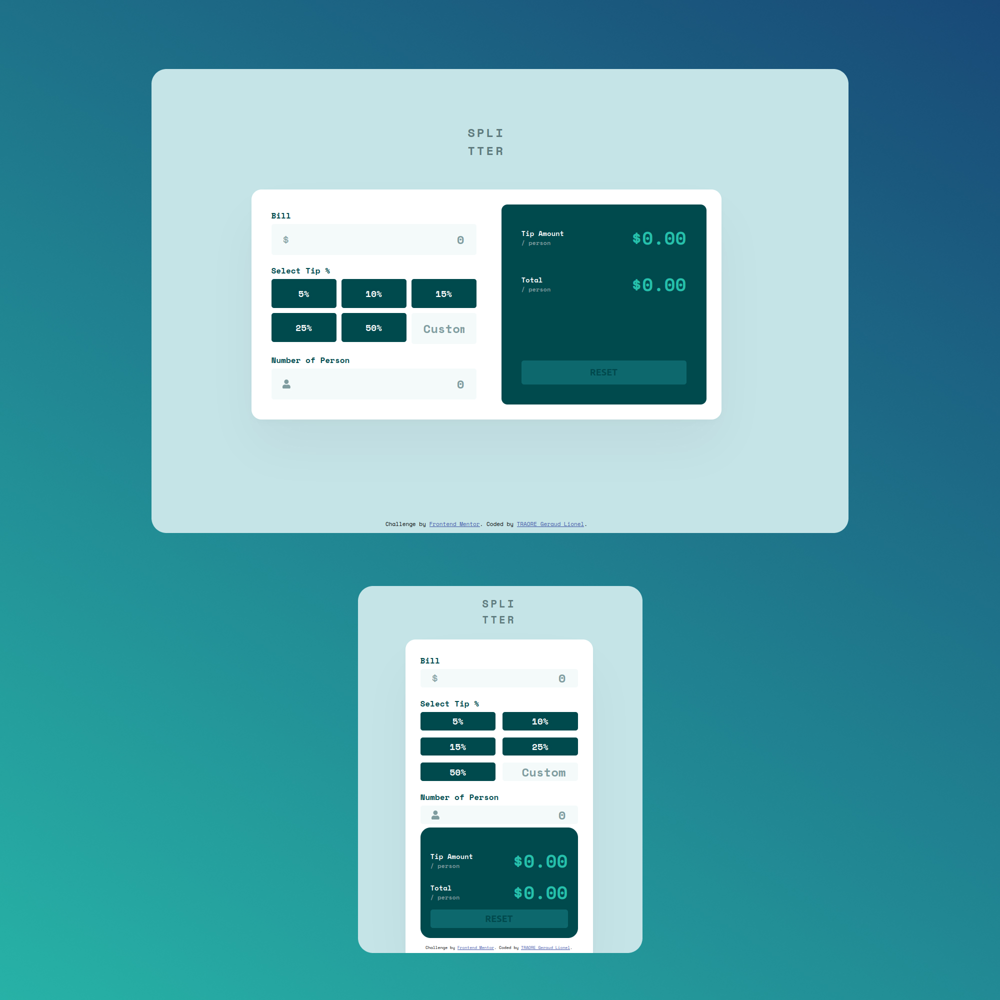

# Frontend Mentor - Tip calculator app solution

This is a solution to the [Tip calculator app challenge on Frontend Mentor](https://www.frontendmentor.io/challenges/tip-calculator-app-ugJNGbJUX). Frontend Mentor challenges help you improve your coding skills by building realistic projects.

## Table of contents

  - [The challenge](#the-challenge)
  - [Screenshot](#screenshot)
  - [Links](#links)
  - [Built with](#built-with)
- [Author](#author)

### The challenge

Users should be able to:

- View the optimal layout for the app depending on their device's screen size
- See hover states for all interactive elements on the page
- Calculate the correct tip and total cost of the bill per person

### Screenshot

### Links

- Solution URL: [frontendmentor.io/solutions](https://www.frontendmentor.io/solutions/responsive-tip-calculator-using-react-sass-flexbox-and-grid-Je9DH9hrb)
- Live Site URL: [traoregex.github.io](https://traoregex.github.io/tip-calculator-fm/)

### Built with

- CSS custom properties
- Flexbox
- CSS Grid
- Mobile-first workflow
- [React](https://reactjs.org/) - JS library

## Author

- Frontend Mentor - [@traoregex](https://www.frontendmentor.io/profile/traoregex)
- Twitter - [@traore_lionel](https://www.twitter.com/yourusername)

